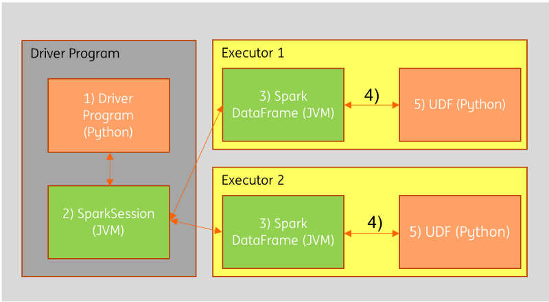

# SPARK UDFS
## Scala UDF 를 Pyspark에서 써보자
### 개요
pyspark에서 파이썬 UDF를 써야할때가 많은데, 여러모로 scala나 java udf 보다 비효율적이라고 한다. (그럼에도 우리는 작은계산정도는 python udf를 그냥 사용하거나, pandas udf 를  잘 활용하고 있긴함)
아래 그림과 같이, 파이썬 UDF를 쓰면 각 워커에서 데이터를 다시 직렬화한뒤 파이썬프로세스로 보내줘야한다(4).<br>
즉, python udf를 쓰면 데이터를 주고 받는 단계가 많다. 
<br>

<br><br><br><br>
**But!**, 성능이 시급할 때가 있다.<br>
이런 경우, 스칼라 (또는 자바)로 작성된 udf를 스파크sql로 등록을 하고, pyspark에서 sql함수로 사용 한다.

```
예상되는 질문

Q: 그건 databricks 노트북에서나 가능하죠. pyspark 어플리케이션에서는 스칼라 코드를 따로 처리할수 없어요.

A: 그래서 jar파일로 빌드해서 쓸껍니다. 그 과정에서 여러 단계가 필요하니 아래 가이드를 잘 읽어주세요 
```

### 선요약
1. scala 로 작성된 udf를 databricks나 zeppelin 노트북에서 테스트 해봅니다.
2. sbt 프로젝트를 생성하고 udf 함수를 만듭니다
3. fat jar (한개로 된 jar파일) 형식으로 assembly compile 합니다 (sbt-assembly 활용)
4. jar파일을 databricks 클러스터에 설치합니다
5. pyspark에서 sql함수로 등록을하고 사용합니다.
6. 성능을 비교합니다
___
### python UDF를 쓰면서 겪는 문제들
"연산량이 많은 udf계산을 하면 너무 오래걸립니다.<br> 예를들면 LCS 같은 알고리즘이 돌아갈 때"<br><br>
LCS??
- Longest Common Substring , 두 문자열간에 공통으로 존재하는 하위 문자열 중,  가장 긴 것의 길이를 구하는 것이다.
    - 시간복잡도는 O(n*m)
- 어뷰징탐지 등, 데이터분석에 많이 쓰이고 있다. 
- 만약 5000길이의 두 시퀀스를 비교하게되면, 한 쌍을 비교하는데 2억5천 번의 연산이 필요하다.
- 모든샘플에 대해서 해야하므로... 자칫 소모적인 탐지 방법이 될수 도 있다. 

<br><br>
#### databricks(또는 zeppelin) notebook 에서 실제 데이터로 비교해본다
 **데이터 설명**<br>
 21개의 샘플, 각 행마다 비교하는 시퀀스의 크기는 평균 1만2천개 이다.  (무척 긴 시퀀스열 2개의 lcs 를 돌린다.  행하나당 1.2만*1.2만 행렬을 순회해야한다 행 하나를 처리하는데도 무척 오래걸릴 것이다.)

|avg(시퀀스1길이)|avg(시퀀스2길이)|행개수|
| :----------------: |:----------------:| :-----:|
|13624.38|12010.67|21
- python UDF를 사용하기
    - 파이썬으로 작성된 LCS함수를 udf 함수로 만들어서 계산해봤다, 
    - 21개 테스트 케이스를 처리하는데 대략 1분20초가 걸렸다 (Command took 1.20 minutes)

- scala UDF databricks 노트북에서 사용하기
    - 노트북에서 스칼라함수를 sql함수로 등록하고 사용했다
    - 21개 테스트 케이스를 처리하는데 대략 6초가 걸렸다  (Command took 6.63 seconds)

훨씬 빨라졌다. 문제는 databricks(또는 zeppelin) 노트북에서 쓸것만이 아니라, 배치시스템에서 사용 하는 것이다. 
___
## 1. sbt 프로젝트로 udf함수를 만든다
sbt 프로젝트 구조 

- /projectRoot
    - /project
        - assembly.sbt
        - build.properties
    - /src
        - /main
            - /scala
                - /yourPackageName
                    - yourModuleName.scala
    - /target
    - build.sbt

assembly.sbt 는 플러그인을 가져오는 sbt 파일입니다. sbt-assembly 플러그인을 가져옵니다. sbt-assembly로 fat jar 파일을 만들 수 있습니다.
~~~sh
addSbtPlugin("com.eed3si9n" % "sbt-assembly" % "0.14.9")
~~~ 
<br>build.sbt 는 프로젝트 빌드시 필요한 여러 변수들을 정의합니다. 여기서는 의존 라이브러리로 sparksql을 불러오고, jar파일 생성시 이름을 지정해줬습니다.
~~~sh
name := "AATUDF"
version := "0.1"
scalaVersion := "2.11.0"
libraryDependencies  ++= Seq(
  "org.apache.spark" %% "spark-sql" % "2.4.0" % "provided"
)
assemblyJarName in assembly := "aatudfs.jar"
test in assembly := {}
~~~ 

- /../projectRoot/src/main/scala/aatudfs/aatudfs.scala 에 모델을 작성합니다. 패키지명과 scala파일 명은 aatudfs 로 통일했다 
- spark sql의 UDF  클래스를 상속 받아 호출함수를 ( def call ) 오버라이드 합니다. 이렇게 하면 sql UDF 함수로 사용이 가능하다.
~~~scala
class LCS_Str extends UDF2[Seq[String],Seq[String], Int] {
  override def call(db: Seq[String],query: Seq[String]): Int = {
    aatAlgo.lcs(db,query) 
  }
}
~~~
<br><br>
## 2. jar파일로 컴파일 합니다.
~~~sh
path/tothe/sbtProejct> sbt clean assembly
 
Java HotSpot(TM) 64-Bit Server VM warning: ignoring option MaxPermSize=256m; support was removed in 8.0
[info] Loading global plugins from C:\Users\xxx\.sbt\1.0\plugins
[info] Loading settings for project aatudfs-build from assembly.sbt ...
[info] Loading project definition from C:\Users\xxx\Desktop\scalaSparkLib\aatudfs\project
[info] Loading settings for project aatudfs from build.sbt ...
[info] Set current project to AATUDF (in build file:/C:/Users/xxx/Desktop/scalaSparkLib/aatudfs/)
[success] Total time: 4 s, completed 2019. 6. 11 오후 7:36:19
[info] Updating ...
[info] Done updating.
[info] Compiling 1 Scala source to C:\Users\xxx\Desktop\scalaSparkLib\aatudfs\target\scala-2.11\classes ...
[info] Done compiling.
[info] Strategy 'discard' was applied to a file (Run the task at debug level to see details)
[info] Packaging C:\Users\xxx\Desktop\scalaSparkLib\aatudfs\target\scala-2.11\aatudfs.jar ...
[info] Done packaging.
[success] Total time: 15 s, completed 2019. 6. 11 오후 7:36:34
~~~

jar파일이 만들어졌습니다. aatudfs.jar<br>

<br><br>
## 3. jar파일을 클러스터에 설치합니다
(databricks 기준)<br>
<br><br>
저기다가 drop 해서 클러스터에 설치합니다.<br>

<br><br>
## 4. pyspark에서 sql함수로 등록을하고 사용합니다.
~~~python
# spark.udf.registerJavaFunction("함수명", "패키지명.클래스명",리턴타입)
spark.udf.registerJavaFunction("lcs", "aatudfs.LCS_Str",T.IntegerType())
df.selectExpr("*","lcs(actionseq,t_actionseq) as lcs")
~~~
<br><br>
## 5. 성능을 비교합니다.
- 파이썬: command took 1.20 minutes 
- 스칼라sql: Command took 3.94 **seconds**
- (테스트 환경)

|avg(시퀀스1길이)|avg(시퀀스2길이)|행개수|
| :----------------: |:----------------:| :-----:|
|13624.38|12010.67|21|

<br><br>
참조한 블로그  (https://medium.com/wbaa/using-scala-udfs-in-pyspark-b70033dd69b9)